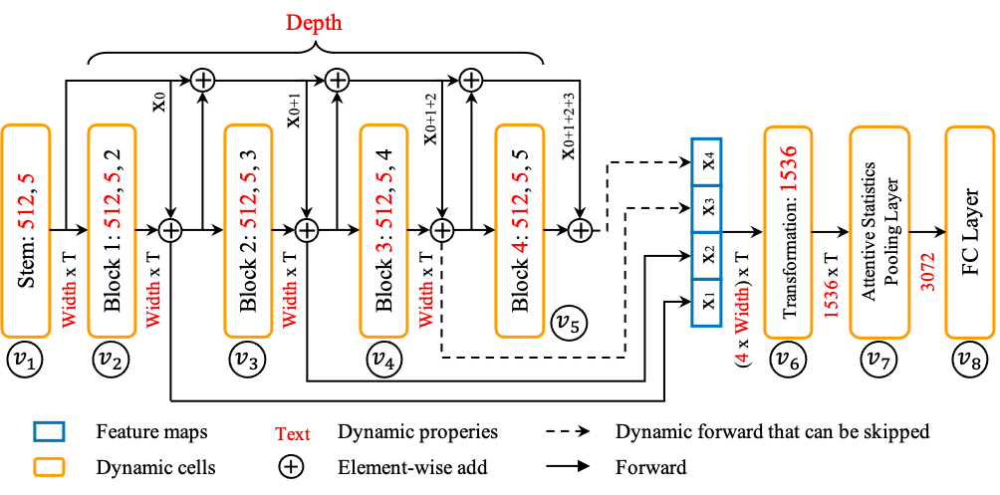

# Sugar

Efficient Speech Processing Tookit for Automatic Speaker Recognition

| **[HuggingFace](https://huggingface.co/mechanicalsea/efficient-tdnn)** |

## What's New



- Neural architecture Search for Speaker Recognition [EfficientTDNN](https://arxiv.org/abs/2103.13581).

## Requirements and Installation

- PyTorch version >= 1.7.1
- Python version >= 3.7.9
- To install sugar:

```bash
git clone https://github.com/mechanicalsea/sugar.git
cd sugar
pip install --editable .
```

We provide pre-trained models for extracting speaker embeddings via [huggingface](https://huggingface.co/mechanicalsea/efficient-tdnn#compute-your-speaker-embeddings).

## Tutorials

- EfficientTDNN: [the evalution of a subnet](./tutorials/EfficientTDNN/EfficientTDNN.ipynb) and [search on the trained supernet](./tutorials/EfficientTDNN/TDNN-NAS.ipynb)

## Citing EfficientTDNN

Please, cite EfficientTDNN if you use it for your research or business.

```bibtex
@article{speechbrain,
  title={{EfficientTDNN}: Efficient Architecture Search for Speaker Recognition in the Wild},
  author={Rui Wang and Zhihua Wei and Haoran Duan and Shouling Ji and Zhen Hong},
  year={2021},
  eprint={2103.13581},
  archivePrefix={arXiv},
  primaryClass={eess.AS},
  note={arXiv:2103.13581}
}
```
